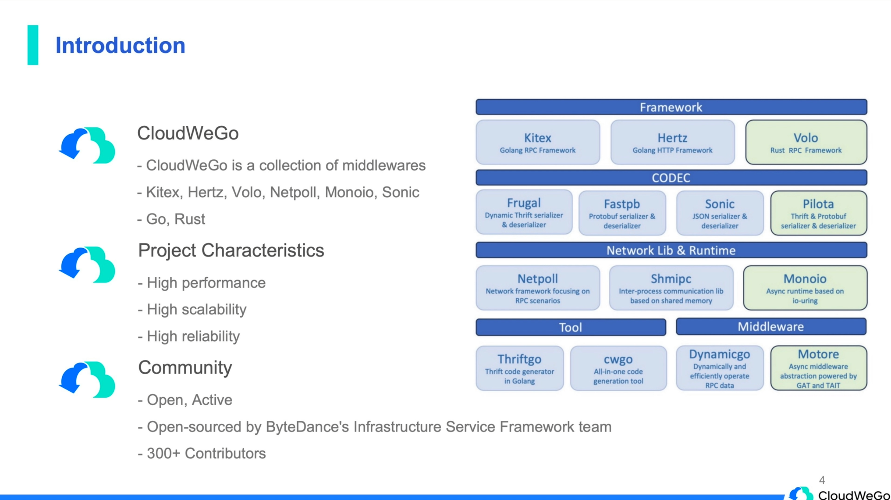
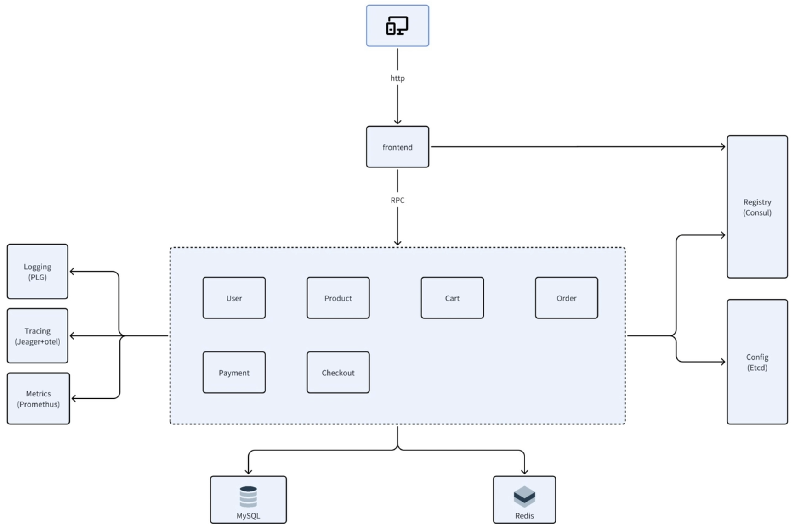

# biz-demo

- Introduction

  Gomall Ecommerce Project Practical Course

  Step-by-step learning how to implement **microservices architecture** using go


- Reference

  [CloudWeGo (github)](https://github.com/cloudwego), [CloudWeGo Hertz](https://www.cloudwego.io/docs/hertz/), [hertz-contrib (github)](https://github.com/hertz-contrib), [CloudWeGo cwgo](https://www.cloudwego.io/docs/cwgo/tutorials/auto-completion/), 
  
  [biz-demo course](https://www.bilibili.com/video/BV1bf421o7NM/?), [biz-demo (github org)](https://github.com/cloudwego/biz-demo), 
  
  [Thrift apache](https://thrift.apache.org/), [Thrift github](https://github.com/apache/thrift), [Thrift](https://diwakergupta.github.io/thrift-missing-guide/), 
  
  [Protobuf](https://protobuf.dev/programming-guides/proto3/), 


## Background Introduction

### Basic conception

- CloudWeGo

  技术项目 企业级的云原生解决方案 提供一组中间件集合

  高性能 高扩展性 高可靠

  开源社区

  `Go`, `Rust`

  `Kitex` (Go RPC Framework), `Hertz` (Go Http Framework), `Volo` (Rust RPC Framework)

  


- Course Design

  Programming Language: `Go`, `HTML CSS JS`

  Technology Stack: `Kitex`, `Hertz`, `cwgo`; `MysSQL`, `Redis`, `GORM`; `Consul`, `ETCD`, `Prometheus`, `OpenTelemetry`; `Docker`, `Kubernetes`

  Business Logic: Ecommerce Project (电商为业务场景)

- Architecture Design

  前端用户界面 (组装数据 渲染页面 RPC调用)

  注册中心 (Consul), 配置中心 (Etcd); 
  
  数据存储 (MySQL, Redis)
  
  


- Plan

  开发准备

  业务实现

  可观测性


### Prepare the development environment

- Overview

  Check the list of all the software and tools we use 

  Code placement

  Generate a hello-world http project using Hertz


- Env

  go: https://go.dev, [go docs](https://go.dev/doc/)

  vscode (plugins: go, golang tools, docker, mysql, material icon theme, yaml, vscode-proto3, makefile tools)

  oh my zsh (plugins: zsh-syntax-highlighting, zsh-autosuggestions)

  Docker

  ```bash
  cd /d/code2/go-code/biz-demo/ && mkdir gomall tutorial
  code .
  cd tutorial/ 
  mkdir ch01/ ch02/ ch03/ ch04/
  
  
  cd ch01/ 
  mkdir hello_world && cd hello_world
  
  go mod init github.com/time1043/biz-demo/tutorial/ch01/hello_world
  go get -u github.com/cloudwego/hertz
  touch main.go
  
  # mian.go ...
  go mod tidy
  go run main.go 
  # localhost:8888/hello
  
  ```
  
- [Hertz Quick Start](https://www.cloudwego.io/docs/hertz/getting-started/)

  ```go
  package main
  
  import (
  	"context"
  
  	"github.com/cloudwego/hertz/pkg/app"
  	"github.com/cloudwego/hertz/pkg/app/server"
  	"github.com/cloudwego/hertz/pkg/protocol/consts"
  )
  
  func main() {
  	h := server.Default()
  
  	h.GET("/hello", func(c context.Context, ctx *app.RequestContext) {
  		ctx.Data(consts.StatusOK, consts.MIMETextPlain, []byte("Hello, Hertz!"))
  	})
  
  	h.Spin()
  }
  
  ```

  


### Generate code with scaffolding

- Overview

  IDL: interface definition language

  CWGO: an all-in-one code generation tool for CloudWeGo

  IDL CloudWeGo extend: IDL work with CloudWeGo

  


- IDL

  用独立于编程语言的方式描述接口

  使得不同平台不同语言运行的程序 可以相互通信

  RPC 需要知道函数签名 (输入参数 + 输出返回值)

- Why IDL

  Standardization & Consistency

  Cross-Language Support

  Version Control & Compatibility

  Simplified Development Workflow

- Example

  [Protobuf](https://protobuf.dev/programming-guides/proto3/), [Thrift IDL](https://thrift.apache.org/docs/idl.html)


- Code

  [cloudwego / cwgo](https://github.com/cloudwego/cwgo), [cloudwego / thriftgo](https://github.com/cloudwego/thriftgo)

  ```bash
  cd idl/
  touch echo.thrift  # echo.thrift ...
  
  # 安装依赖
  GOPROXY=https://goproxy.cn/,direct 
  go install github.com/cloudwego/cwgo@latest
  go install github.com/cloudwego/thriftgo@latest
  
  # 自动补全
  mkdir autocomplete # You can choose any location you like
  cwgo completion bash > ./autocomplete/bash_autocomplete
  source ./autocomplete/bash_autocomplete
  
  mkdir -p demo/dmoe_thrift
  cwgo server --type RPC
  
  ```

  biz-demo\idl\echo.thrift

  ```thrift
  namespace go api
  
  struct Request {
      1: string message
  }
  
  struct Response {
      1: string message
  }
  
  service Echo {
      Response echo(1: Request req)
  }
  
  ```

  


